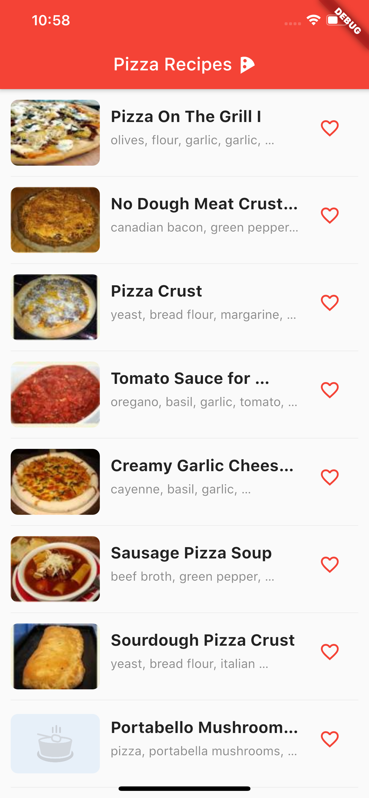
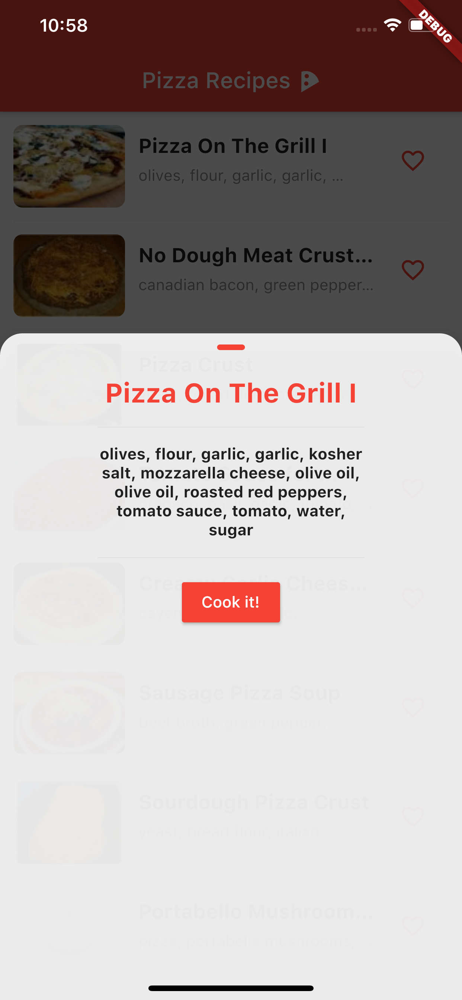
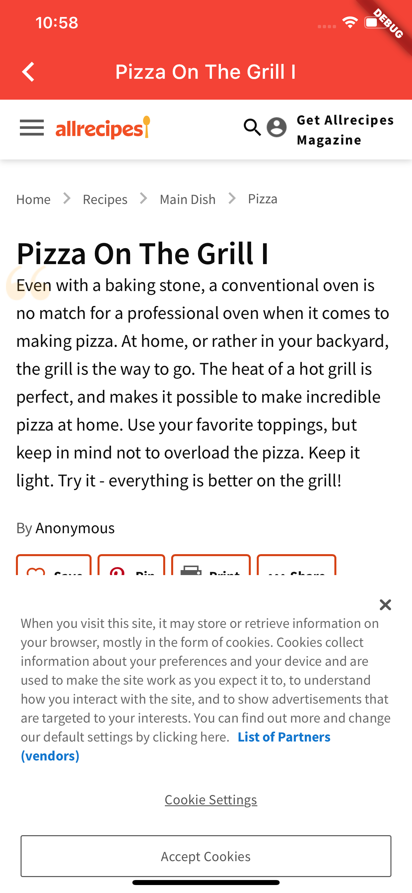

# Pizza Recipes

Finds ***the*** right pizza recipe for you.

## Demo

  

## Learned
- Everything is a widget;
- Passing data to stateful and statless widgets;
- Using RxDart data streams to inform the UI of data changes, and making the UI respond to these changes;
- Seperating software concerenst a.k.a Seperation of Concerns (SOC) using the BLoC architecture;
- Applying the repository pattern in Flutter;
- Handling local widget state;
- Building stateful and stateless widgets;
- Parsing JSON data using a model's factory;
- Requesting data from a REST api using the dart http dependency;
- Building a responsive UI;

## Techniques used
- BLoC architectural pattern (SOC);
- RxDart data streams;
- Dart http network requests;
- Flutter navigation;
- Flutter webview dependency;
